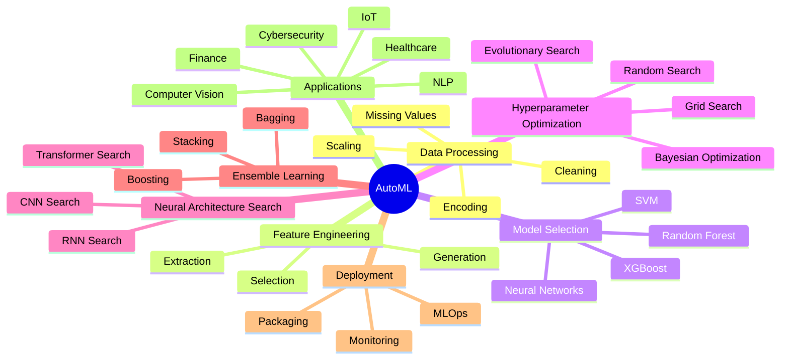

<div align="center">



# **`Awesome`** [Automated Machine Learning](https://wikipedia.org/wiki/Automated_machine_learning) (_[AutoML](https://www.automl.org/automl/)_) [](https://awesome.re)
</div>

[]()
[](https://www.reddit.com/r/datascience/new/)

<p align="center">
    <a href="https://github.com/cybersecurity-dev/"></a>
    &nbsp;
    <a href="https://www.youtube.com/@CyberThreatDefense"></a>
    &nbsp;
    <a href="https://cyberthreatdefence.com/my_awesome_lists"></a>
</p>



```mermaid
graph TD

    A[AutoML]

    A --> B[Automated Data Pipeline]
    A --> C[Automated Feature Engineering]
    A --> D[Automated Modeling]
    A --> E[Automated Optimization]
    A --> F[Automated Deployment]

    B --> B1[Preprocessing]
    B --> B2[Data Cleaning]
    B --> B3[Feature Encoding]

    C --> C1[Selection]
    C --> C2[Extraction]
    C --> C3[Synthesis]

    D --> D1[Traditional ML]
    D --> D2[Deep Learning]
    D --> D3[Ensemble Learning]

    D1 --> D11[SVM]
    D1 --> D12[Random Forest]
    D1 --> D13[XGBoost]

    D2 --> D21[CNN]
    D2 --> D22[RNN]
    D2 --> D23[Transformer]

    E --> E1[HPO]
    E --> E2[NAS]
    E --> E3[Meta Learning]

    E1 --> GridSearch
    E1 --> BayesianOptimization
    E1 --> RandomSearch

    E2 --> RLNAS
    E2 --> EvolutionNAS
    E2 --> DifferentiableNAS

    E3 --> FewShotLearning
    E3 --> TransferLearning

    F --> F1[MLOps]
    F --> F2[Model Monitoring]
    F --> F3[Continuous Training]
```

## 📖 Contents
- [Classical AutoML](#classical-automl)
  - [Auto-sklearn](#auto-sklearn)
- [Deep Learning AutoML](#deep-learning-automl)
  - [Auto-PyTorch](#auto-pytorch)
  - [AutoKeras](#autokeras)
- [My Other Awesome Lists](#my-other-awesome-lists)
- [Contributing](#contributing)
- [Contributors](#contributors)

## Classical AutoML
```text
└──┐
   ├── Auto-WEKA
   ├── Auto-Sklearn
   ├── TPOT
   └── H2O AutoML
```

### Auto-sklearn
> [Auto-sklearn](https://automl.github.io/auto-sklearn) is using the Python library scikit-learn which is a drop-in replacement for regular scikit-learn classifiers and regressors.

### Installing auto-sklearn
* Linux
    * `pip`
      ```bash
        python3 -m venv autosklearn-env
        source autosklearn-env/bin/activate   # activate
        pip3 install auto-sklearn
      ```
      In order to check your installation, you can use:
      ```bash
        python3 -m pip show auto-sklearn      # show auto-sklearn version and location
        python3 -m pip freeze                 # show all installed packages in the environment
        python3 -c "import auto-sklearn; auto-sklearn.show_versions()"
      ```
    * `conda` 
      ```bash
      conda create --name autosklearn-env
      conda activate autosklearn-env          # activate
      conda install auto-sklearn
      ```
      In order to check your installation, you can use:
      ```bash
        conda list auto-sklearn               # show auto-sklearn version and location
        python3 -c "import auto-sklearn; auto-sklearn.show_versions()"
      ```

## Deep Learning AutoML
```text
└──┐
   ├── AutoKeras
   ├── AutoGluon
   ├── NNI
   └── Google AutoML
```
## Auto-PyTorch 
> [Auto-PyTorch](https://github.com/automl/Auto-PyTorch) is based on the deep learning framework PyTorch and jointly optimizes hyperparameters and the neural architecture.

## AutoKeras
> [AutoKeras](https://github.com/keras-team/autokeras): An AutoML system based on Keras.
> AutoKeras is based on Keras so recommend using the PyTorch backend. Please follow this [page](https://github.com/cybersecurity-dev/awesome-pytorch#installation-steps) to install PyTorch.

### Installing AutoKeras

* **`Linux`**
    * `pip`
      ```bash
        python3 -m venv autokeras-env
        source autokeras-env/bin/activate   # activate
        pip3 install autokeras
      ```
      In order to check your installation, you can use:
      ```bash
      ```
    * `conda`
      ```bash
      conda create --name autokeras-env
      conda activate autokeras-env          # activate
      ```
      In order to check your installation, you can use:
      ```bash
      ```

##

### My Other Awesome Lists
You can access the my other awesome lists [here](https://cyberthreatdefence.com/my_awesome_lists)

### Contributing
[Contributions of any kind welcome, just follow the guidelines](contributing.md)!

### Contributors
[Thanks goes to these contributors](https://github.com/cybersecurity-dev/awesome-automl/graphs/contributors)!

### License
[](http://creativecommons.org/publicdomain/zero/1.0)

[🔼 Back to top](#awesome-automated-machine-learning-automl-)
