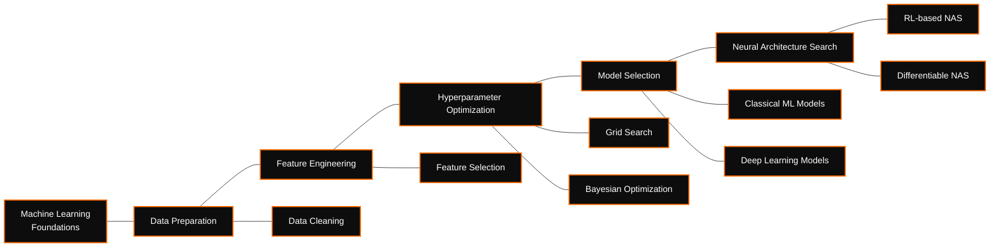

# AutoML Roadmap

```mermaid
flowchart LR

    %% LEFT COLUMN
    A[Machine Learning<br/>Foundations]

    %% CORE
    B[Data Preparation]
    C[Feature Engineering]
    D[Hyperparameter Optimization]
    E[Model Selection]
    F[Neural Architecture Search]

    %% RIGHT
    G[Data Cleaning]
    H[Feature Selection]

    I[Grid Search]
    J[Bayesian Optimization]

    K[Classical ML Models]
    L[Deep Learning Models]

    M[RL-based NAS]
    N[Differentiable NAS]

    %% CONNECTIONS

    A --- B

    B --- C
    C --- D
    D --- E
    E --- F

    B --- G
    C --- H

    D --- I
    D --- J

    E --- K
    E --- L

    F --- M
    F --- N

    %% COLORS
    classDef orange stroke:#ff6b00,color:#ffffff,fill:#0d0d0d,stroke-width:2px;
    class A,B,C,D,E,F,G,H,I,J,K,L,M,N orange;
```
